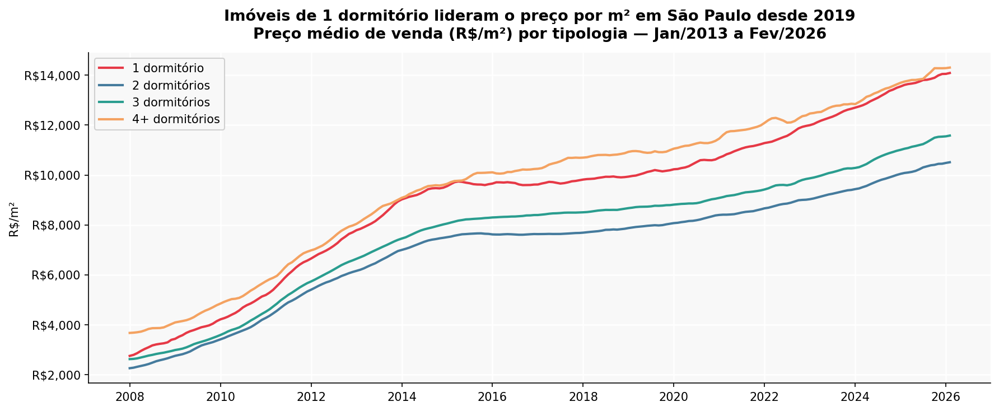
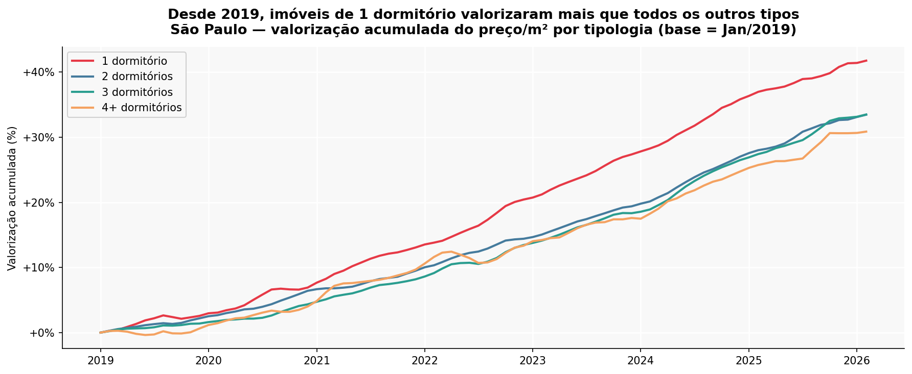
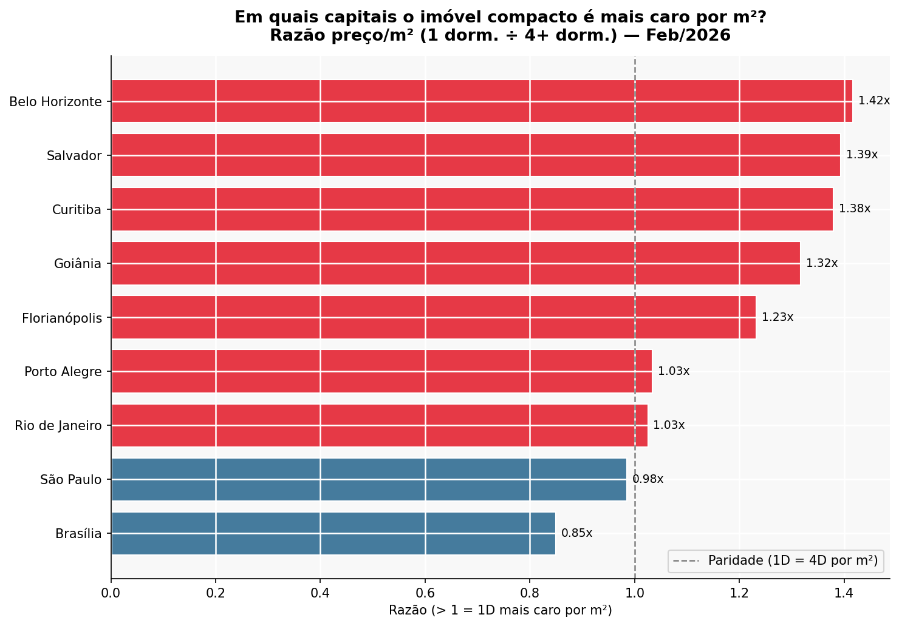
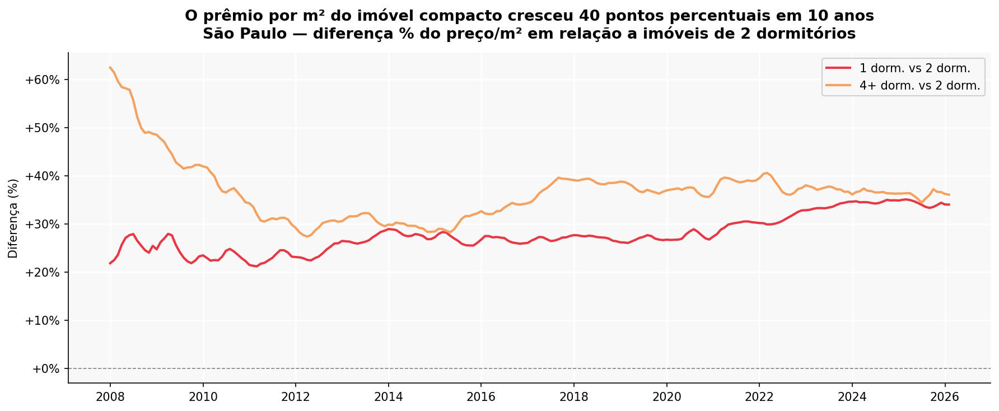

# Imóveis Compactos vs Grandes: Uma Análise do Mercado Imobiliário Brasileiro (2008–2026)

> **Pergunta central:** Imóveis de 1 dormitório realmente valorizam mais por m² do que imóveis maiores? E essa diferença varia entre capitais?

## Resultados principais

- Em São Paulo, imóveis de 1 dormitório valorizaram **+41,8%** desde jan/2019 contra **+30,9%** dos de 4+ dormitórios — diferença de 11 pontos percentuais
- Em **Belo Horizonte**, o compacto custa **1,42x** mais por m² que o imóvel de 4 quartos
- Em **Brasília**, a relação se inverte: imóveis grandes ainda dominam por m²
- O "prêmio" do compacto em SP cresceu consistentemente desde 2013, convergindo hoje com o preço por m² de imóveis de luxo

## Visualizações









## Dataset

| Item | Detalhe |
|------|---------|
| **Fonte** | Índice FipeZAP — série histórica pública |
| **Link** | https://www.fipe.org.br/pt-br/indices/fipezap |
| **Cobertura** | Jan/2008 a Fev/2026 |
| **Cidades** | 21 capitais brasileiras |
| **Registros** | 4.578 linhas após limpeza |

## Estrutura do projeto

```
├── data/
│   ├── fipezap_limpo.csv              # dataset processado (fonte: FipeZAP)
│   ├── grafico1_evolucao_sp.png
│   ├── grafico2_premium_sp.png
│   ├── grafico3_capitais_razao.png
│   └── grafico4_valorizacao_2019.png
├── 01_leitura_dados.py                # ingestão e limpeza dos dados
├── 02_graficos.py                     # geração das visualizações
└── README.md
```

## Como reproduzir

```bash
pip install pandas openpyxl matplotlib
python 01_leitura_dados.py
python 02_graficos.py
```

> O arquivo `fipezap-serieshistoricas.xlsx` não está versionado por ser grande e ter fonte pública.
> Baixe diretamente em: https://www.fipe.org.br/pt-br/indices/fipezap

## Tecnologias


## Autor

**Gabriel Ferreira dos Santos**
[LinkedIn](https://www.linkedin.com/in/eugabrielferreira) · [GitHub](https://github.com/eugabrielferreira)
